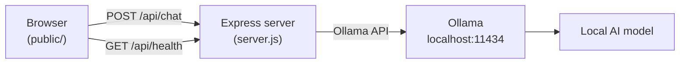

# Local AI Chatbot with Ollama

A lightweight local chatbot: a Node.js backend and a simple web UI that talk to an AI model on your machine through [Ollama](https://ollama.com/). No cloud API keys, no external services — everything runs on your computer.

## Features

- Web chat interface with conversation history
- Connection health check and **Settings** panel: choose **provider** (Ollama, Groq, OpenAI, Gemini) and **model**
- External providers appear only when their API key is set in `.env` (empty key = hidden from the list)
- Default Ollama model and URL via environment variables; last provider/model choice saved in the browser
- Works with any model available in the [Ollama library](https://ollama.com/library)
- **Desktop mode** — standalone window via Electron (no browser tab)

## Quick start

If you already have Node.js 18+ and Ollama installed:

```bash
# 1. Pull a model (recommended for modest laptops)
ollama pull qwen2.5:1.5b

# 2. Configure the app
cp .env.example .env   # Windows: copy .env.example .env

# 3. Install and run
npm install
npm start
```

Open [http://localhost:8086](http://localhost:8086) (or the port set in your `.env` file).

For a **standalone desktop window** (starts the server automatically):

```bash
npm run desktop
```

For development with auto-reload:

```bash
npm run dev
```

---

## Table of contents

- [Requirements](#requirements)
- [How it works](#how-it-works)
- [Project structure](#project-structure)
- [Desktop app](#desktop-app)
- [Setup guide](#setup-guide)
- [Configuration](#configuration)
- [API](#api)
- [Recommended models](#recommended-models)
- [Useful Ollama commands](#useful-ollama-commands)
- [Troubleshooting](#troubleshooting)

---

## Requirements

| Tool | Version |
|------|---------|
| Node.js | 18 or newer |
| npm | included with Node.js |
| Ollama | latest from [ollama.com](https://ollama.com/) |
| A local model | e.g. `qwen2.5:1.5b` |

Verify your setup:

```bash
node -v
npm -v
ollama --version
```

---

## How it works



1. The browser loads the static UI from `public/`.
2. Each message is sent to `POST /api/chat` with the conversation history.
3. The server forwards the request to Ollama's chat API.
4. Ollama runs the configured model locally and returns the reply.

In **desktop mode**, Electron opens the same UI in its own window instead of a browser tab.

---

## Desktop app

Run the chatbot in a native window (Electron). The Express server starts automatically; you do not need `npm start` in a separate terminal.

```bash
npm install
npm run desktop
```

Requirements are the same as the browser version: Ollama must be running and at least one model must be installed.

| Mode | Command | UI |
|------|---------|-----|
| Browser | `npm start` then open the URL | Your web browser |
| Desktop | `npm run desktop` | Electron window |

Do not run `npm start` and `npm run desktop` at the same time — both use the same `PORT` from `.env`.

### Desktop shortcut (Windows)

Create a shortcut on your desktop with one command:

```bash
npm run shortcut
```

This adds **Local AI Chatbot** on the desktop. Double-click it to open the chat in a standalone window (no terminal window, no browser).

Requirements before using the shortcut:

1. `npm install` has been run at least once in the project folder
2. Ollama is running
3. `.env` is configured (optional) and at least one Ollama model is installed

The shortcut uses `scripts/start-desktop.vbs` under the hood. For debugging, you can run `scripts\start-desktop.bat` manually — it shows errors in a console window.

---

## Project structure

```txt
chatbot/
├── server.js          # Express backend and Ollama proxy
├── electron/
│   └── main.js        # Electron entry (desktop window)
├── scripts/
│   ├── start-desktop.bat   # Launcher (shows console)
│   ├── start-desktop.vbs   # Launcher (no console, used by shortcut)
│   └── create-desktop-shortcut.ps1
├── public/
│   ├── index.html     # Chat UI
│   ├── app.js         # Frontend logic
│   └── style.css      # Styles
├── .env.example       # Environment variable template
└── package.json
```

---

## Setup guide

### 1. Install Ollama

**Windows** — download from [ollama.com/download/windows](https://ollama.com/download/windows) or run in PowerShell:

```powershell
irm https://ollama.com/install.ps1 | iex
```

**macOS** — download from [ollama.com/download/mac](https://ollama.com/download/mac) or:

```bash
curl -fsSL https://ollama.com/install.sh | sh
```

**Linux**:

```bash
curl -fsSL https://ollama.com/install.sh | sh
```

After installation, Ollama usually runs in the background. Confirm at [http://localhost:11434](http://localhost:11434) — you should see `Ollama is running`.

### 2. Install a model

Recommended starting point for a modest laptop:

```bash
ollama pull qwen2.5:1.5b
```

Test it in the terminal:

```bash
ollama run qwen2.5:1.5b
```

Type a prompt, then exit with `/bye`.

### 3. Configure the project

Copy the example environment file:

```bash
cp .env.example .env
```

On Windows (PowerShell or CMD):

```powershell
copy .env.example .env
```

See [Configuration](#configuration) for all available variables.

### 4. Install dependencies and start

```bash
npm install
npm start
```

Open the app in your browser at the port defined in `.env` (default in `.env.example`: `8086`; server fallback if no `.env`: `3000`).

---

## Configuration

All settings are read from a `.env` file in the project root:

| Variable | Default (if unset) | Description |
|----------|-------------------|-------------|
| `PORT` | `3000` | Port for the web server |
| `OLLAMA_URL` | `http://localhost:11434` | Ollama API base URL |
| `OLLAMA_MODEL` | `llama3.1` | Default Ollama model on first launch (optional) |
| `GROQ_API_KEY` | — | Enables **Groq** in Settings when set |
| `OPENAI_API_KEY` | — | Enables **OpenAI** in Settings when set |
| `GEMINI_API_KEY` | — | Enables **Gemini** in Settings when set |

Example `.env`:

```env
PORT=8086
OLLAMA_URL=http://localhost:11434
OLLAMA_MODEL=qwen2.5:1.5b

GROQ_API_KEY=your-groq-key
OPENAI_API_KEY=
GEMINI_API_KEY=
```

Only providers with a **non-empty** API key are listed (except **Ollama**, which is always available). Restart the server after adding or changing API keys.

### Choosing provider and model

Open **Settings** (gear icon) → pick **Provider**, then **Model**. Lists are loaded from Ollama (`ollama list`) or the provider API (Groq, OpenAI, Gemini). Your choice is saved in the browser.

**Via API:** `POST /api/settings` with `{ "provider": "groq", "model": "llama-3.1-8b-instant" }`, or pass both in `POST /api/chat`.

---

## API

### `GET /api/health`

Checks providers and lists models per provider.

**Response (success):**

```json
{
  "ok": true,
  "provider": "groq",
  "model": "llama-3.1-8b-instant",
  "defaults": { "provider": "ollama", "model": "qwen2.5:1.5b" },
  "providers": [
    {
      "id": "ollama",
      "label": "Ollama",
      "connected": true,
      "models": ["qwen2.5:1.5b"],
      "error": null
    },
    {
      "id": "groq",
      "label": "Groq",
      "connected": true,
      "models": ["llama-3.1-8b-instant"],
      "error": null
    }
  ],
  "selectionValid": true
}
```

### `POST /api/settings`

Sets the active provider and model.

**Request body:**

```json
{
  "provider": "groq",
  "model": "llama-3.1-8b-instant"
}
```

**Response:**

```json
{
  "provider": "groq",
  "model": "llama-3.1-8b-instant"
}
```

### `POST /api/chat`

Sends a message and returns the model reply.

**Request body:**

```json
{
  "message": "Hello!",
  "provider": "groq",
  "model": "llama-3.1-8b-instant",
  "history": [
    { "role": "user", "content": "Previous question" },
    { "role": "assistant", "content": "Previous answer" }
  ]
}
```

`history`, `provider`, and `model` are optional; the web UI sends all three automatically.

**Response (success):**

```json
{
  "reply": "Hello! How can I help you?"
}
```

---

## Recommended models

Start with **`qwen2.5:1.5b`** — a good balance of speed, memory use, and quality on modest hardware.

| Category | Model | Size | Notes |
|----------|-------|------|-------|
| **Default pick** | `qwen2.5:1.5b` | 1.5B | Best starting point |
| Very small | `gemma3:270m` | 270M | Fastest; limited quality |
| Very small | `qwen2.5:0.5b` | 0.5B | Light; simple tests only |
| Very small | `llama3.2:1b` | 1B | Good fallback if 1.5B is slow |
| Very small | `gemma3:1b` | 1B | Alternative lightweight option |
| More capable | `qwen2.5:3b` | 3B | Better answers; still reasonable |
| More capable | `llama3.2:3b` | 3B | Good general chat |
| More capable | `gemma3:4b` | 4B | Heavier; needs more RAM |
| More capable | `qwen2.5:7b` | 7B | High quality; slow on weak laptops |
| More capable | `mistral:7b` | 7B | Capable; high resource use |
| Coding | `qwen2.5-coder:1.5b` | 1.5B | Recommended for code on modest laptops |
| Coding | `qwen2.5-coder:3b` | 3B | Better code; slower |
| Coding | `qwen2.5-coder:7b` | 7B | Best code quality; heavy |

Install any model with:

```bash
ollama pull <model-name>
```

Browse all models at [ollama.com/library](https://ollama.com/library).

### Model tuning guide

| Situation | Try |
|-----------|-----|
| Too slow | `llama3.2:1b` or `gemma3:270m` |
| Answers too weak | `qwen2.5:3b` or `gemma3:4b` |
| Need code help | `qwen2.5-coder:1.5b` |

---

## Useful Ollama commands

```bash
ollama list                    # installed models
ollama pull qwen2.5:1.5b       # download a model
ollama run qwen2.5:1.5b        # chat in the terminal
ollama rm qwen2.5:1.5b         # remove a model
```

---

## Troubleshooting

### The app cannot connect to Ollama

1. Confirm Ollama is running: `ollama list` or visit [http://localhost:11434](http://localhost:11434).
2. Check `OLLAMA_URL` in `.env` matches your Ollama instance.
3. Restart Ollama if it was installed but never started.

### "Model not found"

Install the model before starting the app:

```bash
ollama pull qwen2.5:1.5b
```

Pick the model from the header dropdown, or install it first with `ollama pull`. Model names must match `ollama list` exactly (including the tag, e.g. `:1.5b`).

### Responses are very slow

Use a smaller model from **Settings** (e.g. `llama3.2:1b` on Ollama), or set `OLLAMA_MODEL=llama3.2:1b` in `.env` as the Ollama startup default.

Close other heavy applications to free RAM/VRAM.

### Responses are low quality

Use a larger model from the dropdown (e.g. `qwen2.5:3b`) if your hardware allows. Run `ollama pull qwen2.5:3b` first if it is not installed yet.

### Port already in use

Change `PORT` in `.env` to another value (e.g. `3001`) and restart.

If you use desktop mode, close any other instance (`npm start` or another `npm run desktop`) before starting again.

---

## Scripts

| Command | Description |
|---------|-------------|
| `npm start` | Start the server (open in browser) |
| `npm run desktop` | Desktop window + server (Electron) |
| `npm run shortcut` | Create a desktop shortcut (Windows) |
| `npm run dev` | Start with nodemon (auto-reload on file changes) |

---

## License

This project is provided as-is for local development and learning.
